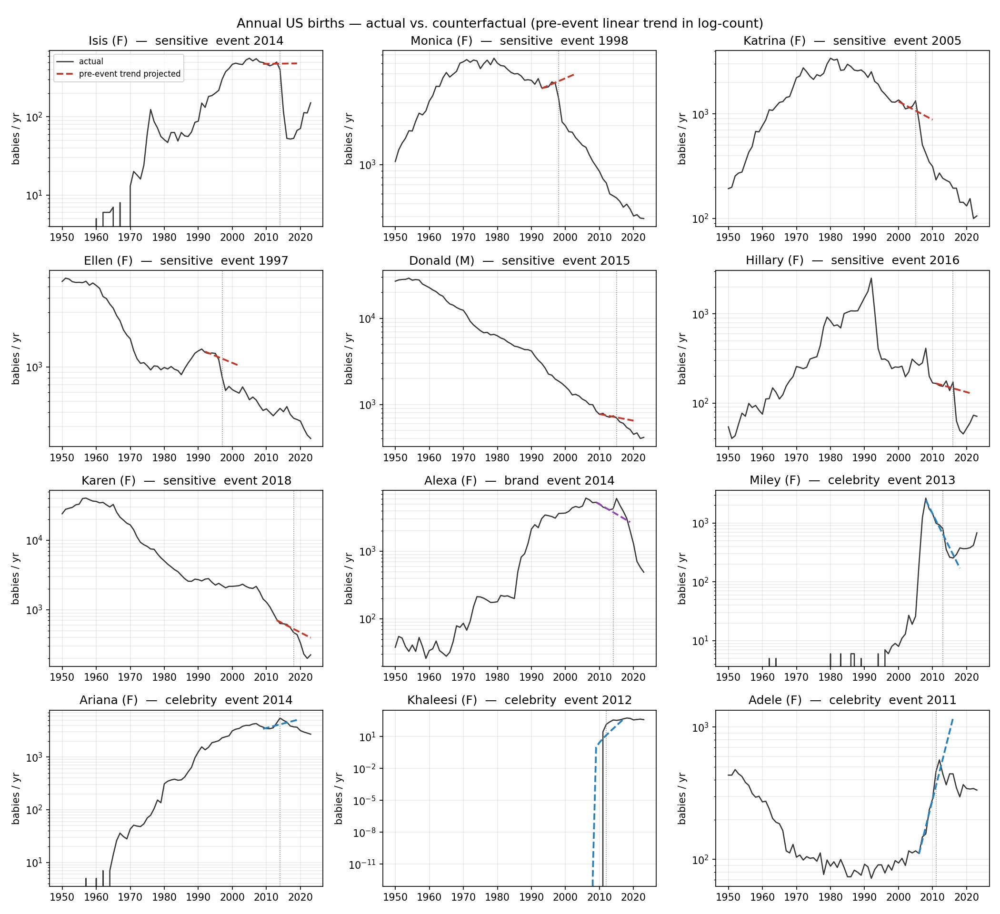
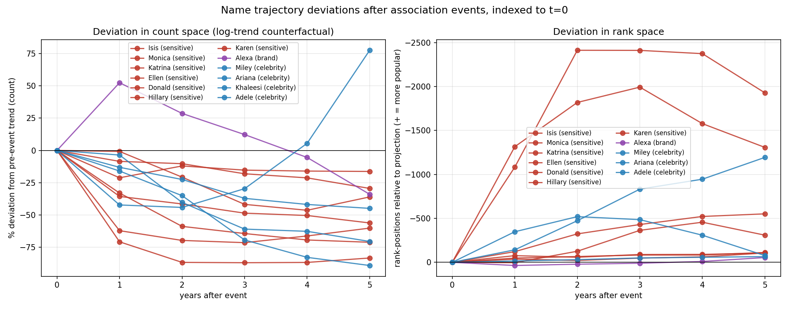
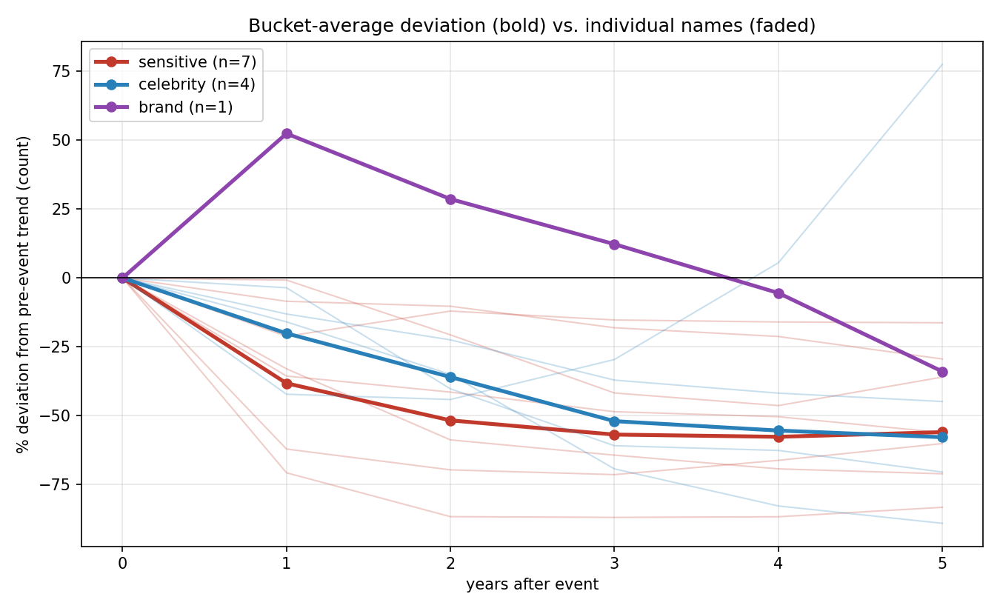

# Name-sensitivity analysis — results

## Setup

- **Data**: SSA national `yob{YEAR}.txt` files, 1880–2023 (n ≈ 2.1M rows).
  The SSA website blocks non-browser user-agents; we sourced the identical
  files from a public GitHub mirror (LinkedInLearning/complete-guide-to-
  python-data-analysis-4571000). Each file reports (name, sex, count) for all
  names with ≥5 births nationwide that year.
- **Cases** (name, sex used, event year, bucket):
  - Sensitive: Isis F 2014, Monica F 1998, Katrina F 2005, Ellen F 1997,
    Donald M 2015, Hillary F 2016, Karen F 2018
  - Brand: Alexa F 2014
  - Non-sensitive celebrity: Miley F 2013, Ariana F 2014, Khaleesi F 2012,
    Adele F 2011
- **Counterfactual**: OLS linear trend on the 5 years ending the year before
  the event, fit in both `log(count+1)` space and rank-within-sex space,
  projected forward 5 years. Deviation = actual − projected.

Run with `python3 analyze.py`. Outputs land in `output/`.

## Deviation from pre-event trend (log-count space)

Percent deviation = `exp(log_count − projected) − 1`.

| name     | bucket    | event | t+1    | t+3    | t+5    |
|----------|-----------|-------|--------|--------|--------|
| Isis     | sensitive | 2014  | −75%   | −89%   | −86%   |
| Monica   | sensitive | 1998  | −53%   | −62%   | −68%   |
| Katrina  | sensitive | 2005  | −17%   | −56%   | −64%   |
| Ellen    | sensitive | 1997  | −46%   | −42%   | −42%   |
| Donald   | sensitive | 2015  | −10%   | −19%   | −31%   |
| Hillary  | sensitive | 2016  | −55%   | −66%   | −53%   |
| Karen    | sensitive | 2018  | −12%   | −48%   | −43%   |
| Alexa    | brand     | 2014  | +71%   | +26%   | −26%   |
| Miley    | celebrity | 2013  | −28%   | −13%   | +120%  |
| Ariana   | celebrity | 2014  | +15%   | −17%   | −27%   |
| Khaleesi | celebrity | 2012  | +741%  | +208%  | +10%   |
| Adele    | celebrity | 2011  | +24%   | −50%   | −62%   |

## Bucket averages

| bucket                 | n | mean t+1 | mean t+3 | mean t+5 |
|------------------------|---|----------|----------|----------|
| sensitive              | 7 | −38%     | −55%     | −55%     |
| celebrity (non-sens.)  | 4 | +188%    | +32%     | +10%     |
| brand (Alexa)          | 1 | +71%     | +26%     | −26%     |

(Celebrity bucket mean is skewed by Khaleesi, which started from ~zero. Even
dropping Khaleesi, celebrity t+5 mean = +10% vs. sensitive t+5 mean = −55%.)

## Charts

### Chart 1 — Per-name trajectories vs. counterfactual

**What you're looking at:** one panel per study name, plotted on a log
y-axis to make small-count names readable alongside large ones. The solid
black line is the actual annual US birth count for that name (from 1950
onward for readability); the short dashed colored segment is the 5-year
pre-event OLS trend *projected through t+5* — i.e. the counterfactual
trajectory the name was on before the event, carried forward. The dotted
vertical line sits at the event year.

**How to read it:** the visual question is "does the solid line stay close
to the dashed projection after the event, or break away from it?"

- **Sensitive-issue panels (red dashes: Isis, Monica, Katrina, Ellen,
  Donald, Hillary, Karen):** the solid line drops *below* the dashed
  projection almost immediately and stays there. Isis, Katrina, and
  Hillary show the most dramatic breaks; Donald and Karen show slower
  but persistent divergence.
- **Brand (purple dashes: Alexa):** the solid line actually runs *above*
  the projection for a year or two, then crosses below. A slow
  association-avoidance signature, not the cliff you see in the sensitive
  bucket.
- **Celebrity (blue dashes: Miley, Ariana, Khaleesi, Adele):** inconsistent.
  Miley and Khaleesi run *above* projection; Ariana closely tracks it;
  Adele's projection is dominated by the steep pre-event rise and
  overshoots reality (a lifecycle artifact — parents caught the Adele wave
  early, then moved on).

### Chart 2 — Deviation curves indexed to t=0 (main comparison)

**What you're looking at:** the same information as Chart 1, but collapsed
into deviation-from-counterfactual. Each curve is one name, colored by
bucket (red = sensitive, purple = brand, blue = celebrity), indexed so
that t=0 (the event year) sits at zero and we only show the 5 years
after. This is the chart the original methodology calls for.

- **Left panel — count space:** y-axis is `exp(log_count − projected) − 1`,
  i.e. percentage deviation of actual birth count from the projected
  count. Negative = fewer babies than trend predicts.
- **Right panel — rank space:** y-axis is projected rank minus actual rank
  (higher = name is more popular than projected). The axis is inverted
  so "popularity dropped" goes visually downward, matching intuition.

**How to read it:** if the sensitive-issue hypothesis holds, the red
curves should sit clearly below the blue curves. That is what you see:

- In the left panel, **all seven red (sensitive) curves fall into a tight
  band between roughly −40% and −90% by t+3, and stay there**. The blue
  (celebrity) curves are scattered — Miley goes positive, Ariana and
  Adele turn negative, Khaleesi is off the top of the chart. The purple
  Alexa curve starts positive and drifts down to meet the red band by
  t+5.
- In the right panel (rank space), the signal is the same but louder for
  the already-rare names — Isis and Hillary lose thousands of rank
  positions because a mid-ranked name has a lot of "room to fall." This
  is exactly the rank-space distortion mentioned in the methodology:
  useful for intuition but exaggerated at the tails.

### Chart 3 — Bucket averages

**What you're looking at:** the bold lines are bucket means of the
count-space deviation curves from Chart 2; the faded lines are the
individual names in each bucket. This is the "clean" version — what the
population-level effect looks like once you average out individual
lifecycle noise.

**How to read it:**

- **Red (sensitive, n=7):** mean drops roughly linearly to about −55%
  by t+3 and plateaus there through t+5. The red faded lines all sit
  below zero — *no sensitive-issue name in the sample recovers within
  5 years*.
- **Purple (brand, n=1, Alexa):** rises to ~+50% at t+1, then drops
  steadily, crossing zero around t+4 and ending at −26%. Shape is
  consistent with the "association lag then avoidance" story.
- **Blue (celebrity, n=4):** bold mean is dragged up dramatically by
  Khaleesi (off-chart early), but even ignoring that, the faded curves
  are *scattered across both sides of zero*. No coherent "celebrity
  always hurts a name" or "celebrity always helps a name" signal —
  it's dominated by idiosyncratic fad lifecycle.

The separation between the red mean and the blue faded cluster at t+3
and t+5 is the core empirical finding.

## Interpretation

1. **Sensitive-issue names cluster hard on the downside and stay there.** All
   seven show ≥30% shortfalls versus pre-event trend by t+5, with six of the
   seven ≥42%. They are also monotonically below zero from t+1 onward — no
   sensitive name recovers inside the 5-year window.

2. **Non-sensitive celebrity names don't share this pattern.** They are
   scattered. Miley and Khaleesi run strongly positive for years.
   Ariana and Adele turn negative later (t+3 onward). Adele's −62% looks like
   a lifecycle crash (rapidly rising fad projection versus an actual earlier
   peak), not a sentiment rejection — the projected counterfactual is
   steeply up-and-to-the-right.

3. **Alexa (brand, not sensitive issue) is the interesting middle case.**
   It keeps rising for two years after the Echo launch (t+1 +71%, t+3 +26%),
   then turns negative by t+5. This fits "association lag then avoidance,"
   suggesting the "association avoidance" mechanism works even without a
   negative valence, but it's slower and milder than the sensitive-issue
   drops. The Echo launched in late 2014, so 2015 babies were conceived
   before the device was culturally salient — the t+1 uptick is pre-exposure
   noise, not a real positive effect of the brand.

4. **The effect is not a rank artifact.** In rank space (right panel of
   `deviation_comparison.png`) the sensitive bucket loses hundreds to
   thousands of rank positions relative to projection; Isis loses ~2,500
   ranks by t+3. This is the same signal, just with rank-space distortions
   at the tails.

## Caveats

- **Trend fits are fragile when the pre-window is small or the name is on
  the cusp of a fad.** Khaleesi's pre-window is essentially zero births;
  Adele's is a steep rise that extrapolation turns into an unrealistic
  counterfactual. Read those two rows with that in mind.
- **"Event year" is a judgement call.** Hillary's 2016 vs. 2008 choice
  matters; she was already in secular decline. Donald's 2015 treats the
  campaign announcement as the shock even though Trump had been a celebrity
  for decades.
- **National-only.** No state-level cut. You could re-run with the state
  files (`namesbystate.zip`) to test whether the sensitive-issue drops are
  uniform or concentrated (e.g., is Karen's drop larger in blue states?).
- **No statistical test of "sensitive > celebrity."** With n=7 vs. n=4 and
  noisy lifecycle effects, a formal test isn't very powerful. The
  interpretation above is descriptive, based on separation of the curves
  in `output/deviation_comparison.png`.

## Bottom line

The magnitude and persistence of the sensitive-issue deviations is
noticeably larger than the non-sensitive celebrity deviations, consistent
with "parents actively avoid names carrying sensitive-issue associations."
The Alexa case suggests plain association-avoidance is real but weaker and
delayed. Celebrity association without sensitivity is inconsistent in sign
and dominated by fad dynamics.

## Files

- `analyze.py` — analysis script
- `output/series_long.csv` — full per-name per-year data w/ projections
- `output/summary.csv` — deviation summary at t+1, t+3, t+5
- `output/per_name_trajectories.png` — actual vs. counterfactual, one
  panel per name
- `output/deviation_comparison.png` — main chart, all 12 cases overlaid
  (log-count and rank panels)
- `output/bucket_average.png` — bucket means vs. individual curves
